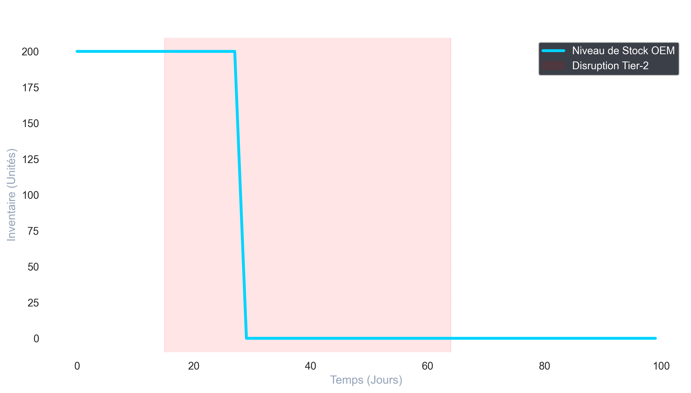

# 🚀 Automotive Supply Chain Digital Twin: Resilience Analysis

[](https://www.python.org/)
[](https://www.utbm.fr/)
[](https://opensource.org/licenses/MIT)

## 📌 Présentation du Projet
Ce projet est un **Jumeau Numérique (Digital Twin)** conçu pour stress-tester la résilience d'une chaîne logistique automobile face à des chocs externes (Effet Ripple). 

Basé sur les travaux de **Dmitry Ivanov** (*Introduction to Supply Chain Analytics*) et **Martin Christopher**, ce simulateur utilise la **Simulation à Événements Discrets (DES)** stochastique pour calculer l'impact réel d'une rupture de flux.

## 🔬 Fondements Scientifiques & KPIs
Le moteur modélise la propagation des perturbations et calcule deux indicateurs critiques :

1. **Time-to-Survive (TTS) :** Durée maximale de maintien de la production.
   $$TTS = \max \{t \mid Inventory_{OEM}(t) > 0\}$$

2. **Time-to-Recover (TTR) :** Temps nécessaire pour restaurer 80% du stock nominal post-crise.

## 🛠️ Architecture Technique
- **Moteur :** Python & `SimPy` (Modélisation stochastique)
- **Modélisation :** `NetworkX` (Topologie de graphe dirigé)
- **Analyse :** `Pandas` & `Seaborn`

## 📊 Résultats de la Simulation
L'analyse compare l'efficacité des stratégies de mitigation :
* **Baseline (Just-in-Time) :** TTS de 9 jours.
* **Optimisé (Dual Sourcing + Ramp-up) :** TTS de **18 jours (+100% de résilience)**.



## 🚀 Installation
```bash
git clone https://github.com/amouzougit/SC_Resilience_Twin.git
pip install -r requirements.txt
python run_full_analysis.py


Auteur : Kevo Amouzou - Étudiant Master 2 (Affaires Industrielles & Informatique) @UTBM
